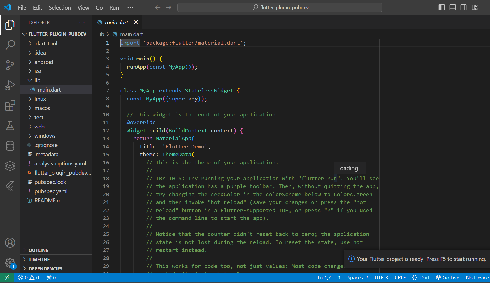
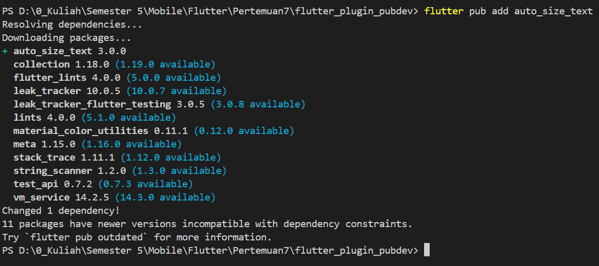
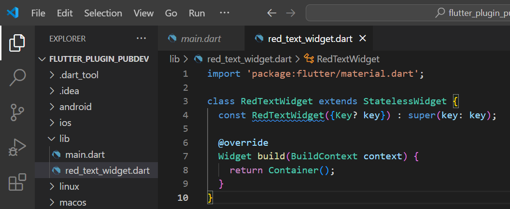
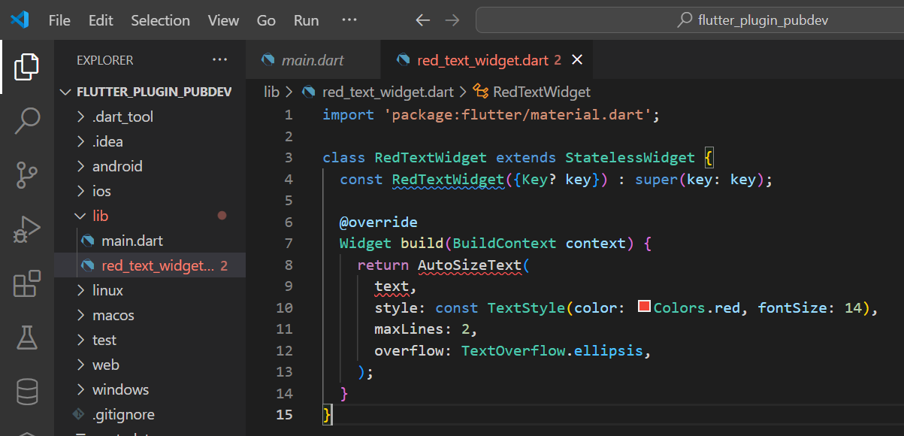
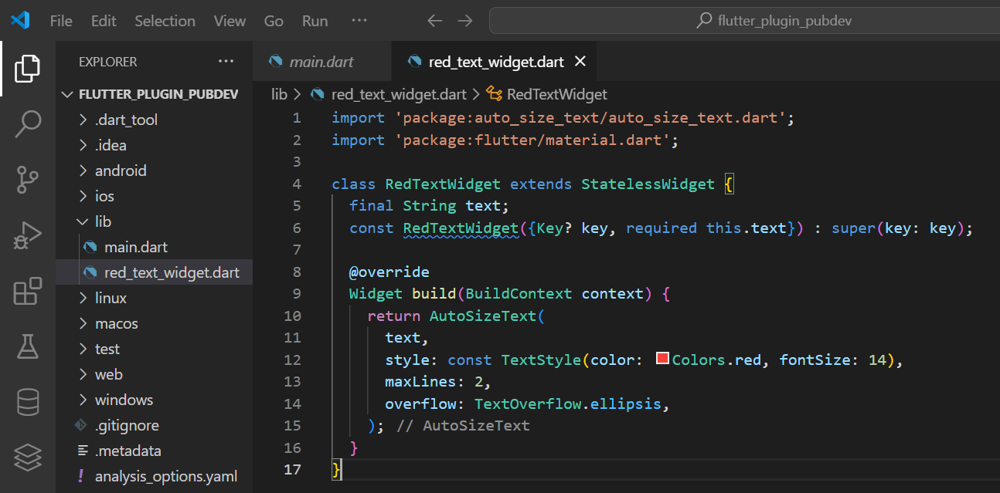
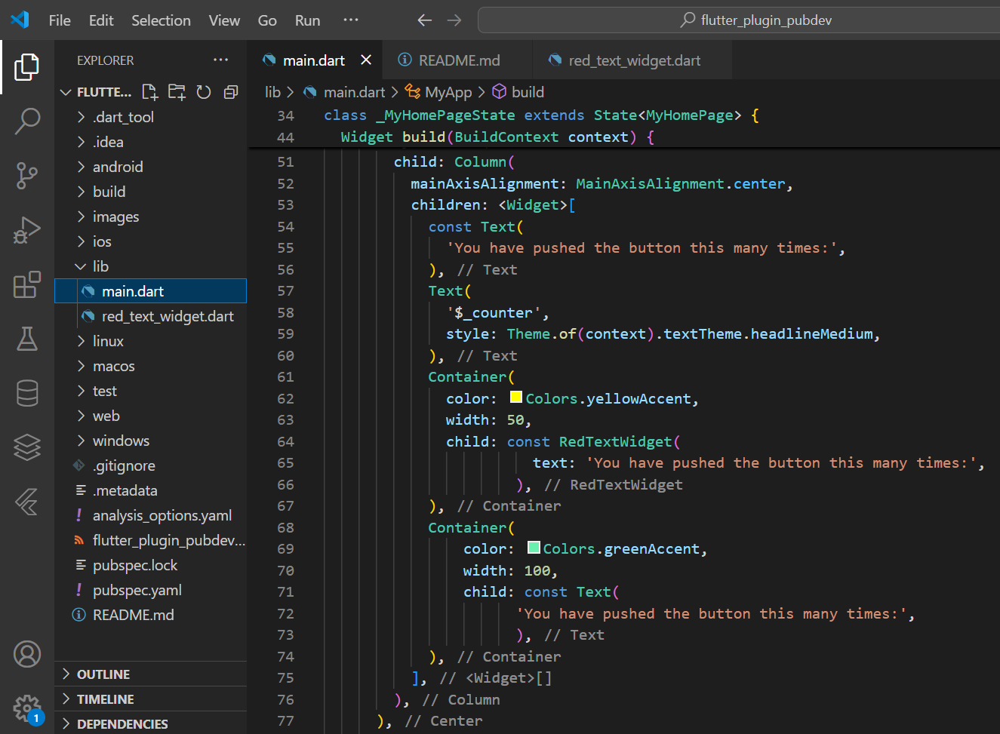
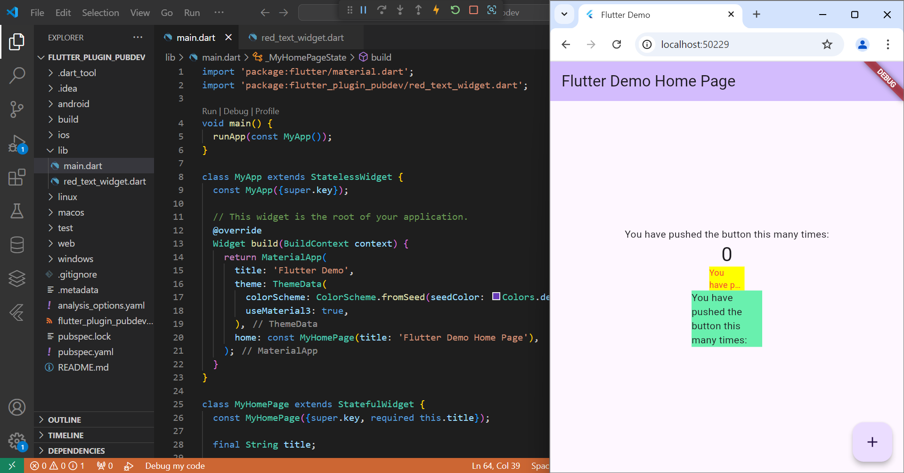

# Jobsheet 7

> Nama : Dyinastie Marchelina Puspiatwening

> Kelas : TI-3D

> No. Absen : 08

---

## Praktikum

### Langkah 1 : Buat Project Baru

### Langkah 2 : Menambahkan Plugin

### Langkah 3 : Buat file red_text_widget.dart

### Langkah 4 : Tambah Widget AutoSizeText

Setelah menambahkan kode di atas, akan mendapatkan info error. Mengapa demikian?

Error yang muncul disebabkan oleh penggunaan parameter `text` yang tidak terdefinisi dalam konstruktor `AutoSizeText`. Dalam kode yang ada, `text` belum dideklarasikan sebagai parameter untuk `RedTextWidget`, sehingga menyebabkan error pada saat mencoba membangun widget.

### Langkah 5 : Buat Variabel text dan parameter di constructor

### Langkah 6 : Tambahkan widget di main.dart

### Hasil

---

## Tugas

1. Selesaikan Praktikum tersebut, lalu dokumentasikan dan push ke repository Anda berupa screenshot hasil pekerjaan beserta penjelasannya di file README.md!

    Hasil dokumentasi dapat dilihat pada subbab Praktikum.

2. Jelaskan maksud dari langkah 2 pada praktikum tersebut!

    Perintah flutter pub add auto_size_text digunakan untuk menambahkan paket auto_size_text ke dalam proyek Flutter. `flutter pub add:`  adalah perintah untuk mengelola dependensi dalam proyek Flutter.`auto_size_text:` adalah paket yang memungkinkan teks dalam aplikasi Flutter menyesuaikan ukuran font-nya secara otomatis berdasarkan ruang yang tersedia. Ini sangat berguna untuk memastikan bahwa teks selalu terlihat rapi dan tidak terpotong, terutama pada tampilan dengan ukuran berbeda.

3. Jelaskan maksud dari langkah 5 pada praktikum tersebut!

    Langkah ini mendefinisikan properti `text` yang akan digunakan oleh `RedTextWidget`, memastikan bahwa widget tersebut menerima dan menampilkan teks yang diberikan saat dibuat. `final String text;` langkah ini mendeklarasikan variabel `text` sebagai string. `const RedTextWidget({Key? key, required this.text}) : super(key: key);` langkah ini artiny konstruktor RedTextWidget didefinisikan sebagai konstanta, dengan parameter opsional key dan parameter wajib text, yang mengatur nilai untuk variabel text dan meneruskan key ke konstruktor induk.

4. Pada langkah 6 terdapat dua widget yang ditambahkan, jelaskan fungsi dan perbedaannya!

    Widget Pertama (RedTextWidget): Menampilkan teks dengan warna merah dan fitur penyesuaian ukuran teks, memberikan gaya khusus.Widget Kedua (Text): Menampilkan teks dengan warna default dan tidak memiliki fitur penyesuaian ukuran teks, merupakan widget dasar tanpa gaya khusus.

5. Jelaskan maksud dari tiap parameter yang ada di dalam plugin auto_size_text berdasarkan tautan pada dokumentasi ini !

     - **key**: Mengontrol bagaimana satu widget menggantikan widget lain dalam pohon widget. Ini berguna untuk manajemen status dan pemeliharaan identitas widget dalam pohon.
    - **textKey**: Menetapkan kunci untuk widget Text yang dihasilkan, yang juga membantu dalam pengelolaan status.
    - **style**: Jika tidak null, ini menentukan gaya yang digunakan untuk teks, termasuk ukuran font, warna, dan gaya lainnya.
    - **minFontSize**: Batas minimum ukuran teks yang digunakan saat menyesuaikan ukuran teks. Parameter ini diabaikan jika `presetFontSizes` ditetapkan.
    - **maxFontSize**: Batas maksimum ukuran teks yang digunakan saat menyesuaikan ukuran teks. Ini juga diabaikan jika `presetFontSizes` ditetapkan.
    - **stepGranularity**: Ukuran langkah di mana ukuran font disesuaikan dengan batasan yang ada.
    - **presetFontSizes**: Menentukan semua ukuran font yang mungkin. Ukuran-ukuran ini harus dalam urutan menurun agar berfungsi dengan baik.
    - **group**: Mengsinkronkan ukuran beberapa AutoSizeText, sehingga dapat memiliki ukuran yang konsisten.
    - **textAlign**: Menentukan bagaimana teks harus diratakan secara horizontal (misalnya, kiri, tengah, kanan).
    - **textDirection**: Arah teks, memengaruhi bagaimana nilai `textAlign` seperti `TextAlign.start` dan `TextAlign.end` diinterpretasikan.
    - **locale**: Digunakan untuk memilih font saat karakter Unicode yang sama dapat dirender dengan cara yang berbeda tergantung pada lokal.
    - **softWrap**: Menentukan apakah teks harus terputus pada garis putus.
    - **wrapWords**: Menentukan apakah kata-kata yang tidak muat dalam satu baris harus dibungkus. Secara default, ini diatur ke true, berperilaku seperti widget Text biasa.
    - **overflow**: Menentukan bagaimana kelebihan visual harus ditangani jika teks melampaui batasnya.
    - **overflowReplacement**: Jika teks meluap dan tidak muat dalam batas, widget ini akan ditampilkan sebagai pengganti.
    - **textScaleFactor**: Mengukur jumlah piksel font untuk setiap piksel logis, juga memengaruhi `minFontSize`, `maxFontSize`, dan `presetFontSizes`.
    - **maxLines**: Jumlah maksimum baris opsional yang dapat dilalui teks.
    - **semanticsLabel**: Label semantik alternatif untuk teks ini, berguna untuk aksesibilitas.
    
6. Kumpulkan laporan praktikum Anda berupa link repository GitHub kepada dosen!

    Baik.